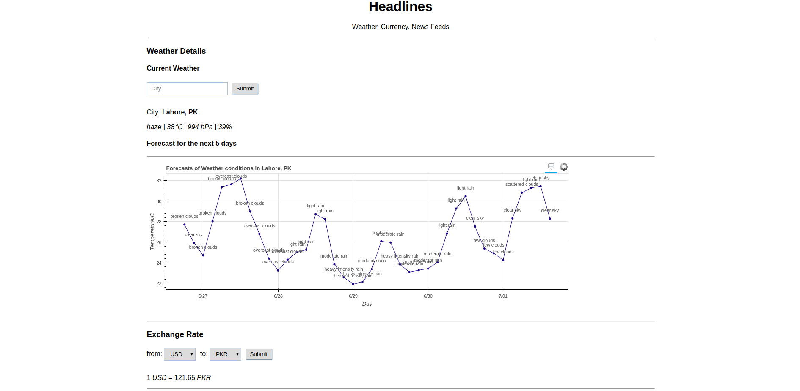
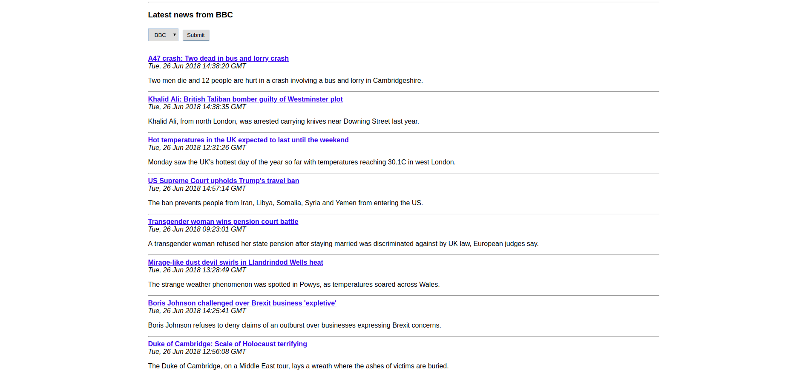

# Weather. Currency Rate. News Feeds

A simple Flask/Python based web applicaton that makes use of openweather api, openexchange rate api and RSS from several news channels to pull latest data and present it in a simple way. The application allows a user to select the city for which she wants to get current weather along with 5 day weather forcast. In addition, user can get the currency exchange rate for popular currencies and finally, the user has an option to see latest feeds from several new channels.
Lastly, the app was deployed on EC2/AWS and configured to share it with the world :) 

  

  

